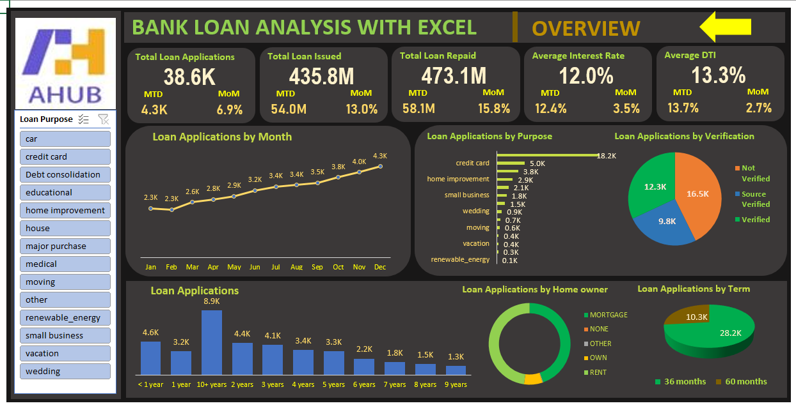
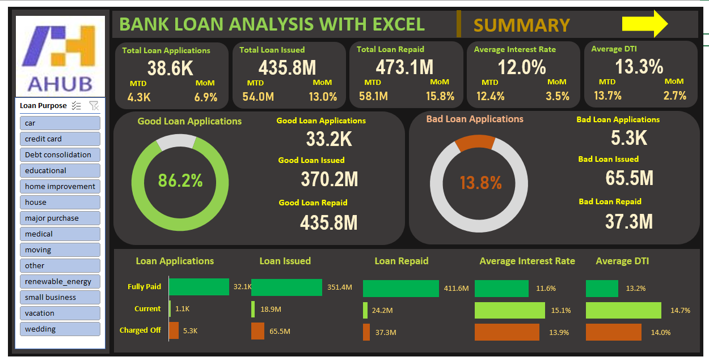

# Bank-Loan-Analysis
## 📊 Bank Loan Analysis Project
This project provides an in-depth analysis of bank loan applications using Microsoft Excel dashboards. It aims to uncover patterns in loan approvals, repayment behavior, and risk levels based on key indicators such as loan purpose, term, employment history, verification status, and repayment outcome.

## 🧾 Executive Summary
The bank loan analysis project explores trends in 38.6K loan applications worth over $435.8 million. It distinguishes between good and bad loans, examines repayment patterns, and identifies high-risk categories based on demographics and employment data. The findings help inform policy changes and risk mitigation strategies.

## 📌 Key Insights
### 🧮 Overview Dashboard
Total Applications: 38.6K

Total Loan Issued: $435.8M

Total Loan Repaid: $473.1M

Average Interest Rate: 12.0%

Average DTI (Debt-to-Income): 13.3%

Monthly Growth: ~4.3K applications per month

Top Loan Purposes: Credit card and home improvement

Term Preference: 36-month terms are more popular than 60-months

Verification: Majority are source verified or not verified

Home Ownership: Majority of applicants are homeowners

### 📉 Summary Dashboard
Good Loans: 86.2% (33.2K applications)

Bad Loans: 13.8% (5.3K applications)

Fully Paid Loans: 93.7%

Charged Off Loans: 6.3%

Employment History: Applicants with 10+ years had the most applications

Performance: Good loans had the highest issuance and repayment value

## ✅ Conclusion
The bank’s portfolio shows a high success rate in repayment, with good loans constituting a strong majority. Although charged-off loans remain minimal, targeting improved verification and analyzing employment status can reduce the bad loan ratio further. These insights guide better risk management and policy formulation.

## 🛠️ Tools Used
Microsoft Excel – Data cleaning, visualization, and dashboard creation

MS Word  – Documentation

## 📎 Files Included
File	Description
Loan-Overview.png	Visual dashboard showing KPIs like total loan issued, average interest, etc.
Loan-Summary.png	Summary insights including good vs bad loan performance
Bank_Loan_Analysis_Report.docx	Detailed report in APA format
Bank_Loan_Analysis_Report.pdf	Same report in PDF format
Bank_Loan_Analysis_Report.pptx	Slide presentation summarizing the project
